# 4x8bit_dac
4 x 8 Bit DAC taget to openroad/openlane flow and sky130 foundary

# Prerequisites
```bash
   #Step-1: Installing Klayout
   sudo apt-get install  klayout

   #Step-2: To install Sky130nm PDK
    A. Add/Set following  Enviornment variable 
       export PDK_ROOT=<PDK Installation folder> 
       export PDK=sky130A
    B. Clone Openlane : 
       git clone https://github.com/efabless/OpenLane.git
       cd Openlane
       make pdk

   #Step-3: Installing ngspice from source code
    git clone git://git.code.sf.net/p/ngspice/ngspice
    cd ngspice
    ./autogen.sh
    mkdir debug
    cd debug
    ../configure --with-x --with-readline=yes
    make
    sudo make install

   #Step-4: To clone the Skywater PDK Library for ngsim
     git clone https://github.com/google/skywater-pdk-libs-sky130_fd_pr

   #Step-5: Install the ESim
     https://esim.fossee.in/downloads
     https://static.fossee.in/esim/installation-files/eSim-2.3.zip
     unzip eSim-2.3.zip
     cd eSim-2.3
     chmod +x install-eSim.sh
     sudo /install-eSim.sh --install
```
# Extract Spice
```bash
   cd PostLayoutSimulation
   ./run_extract_spice
```

# Run the Klayout FEOL/BEOL/Density/Zero Area/overlapping check
```bash
   cd PostLayout
   ./run_precheck
```

# Post Layout Simulation
```bash
   ngspice resistor_test.spice
```
   <table> <tr> <td  align="center">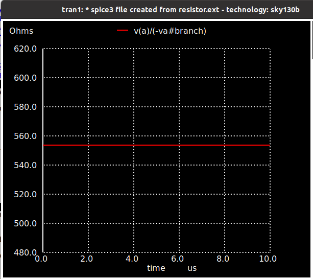</td> </tr> </table>

```bash
   ngspice switch_test.spice
```
   <table> <tr> <td  align="center">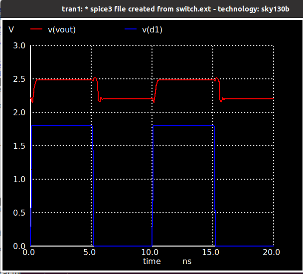</td> </tr> </table>

```bash
   ngspice switch2_test.spice
```
   <table> <tr> <td  align="center">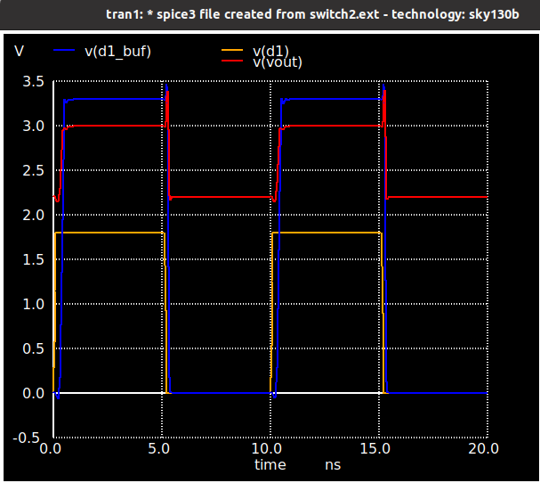</td> </tr> </table>


```bash
   ngspice switch2n_test.spice
```
   <table> <tr> <td  align="center">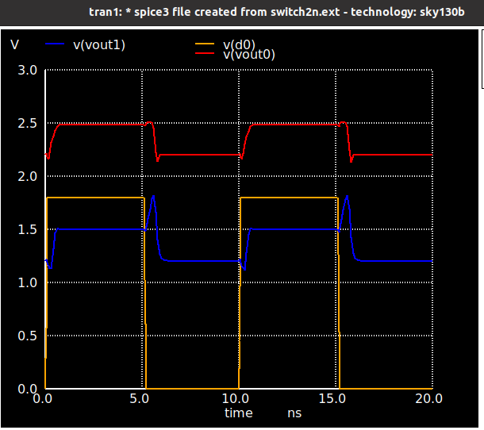</td> </tr> </table>

```bash
   ngspice 2bit_DAC_test.spice 
```
   <table> <tr> <td  align="center">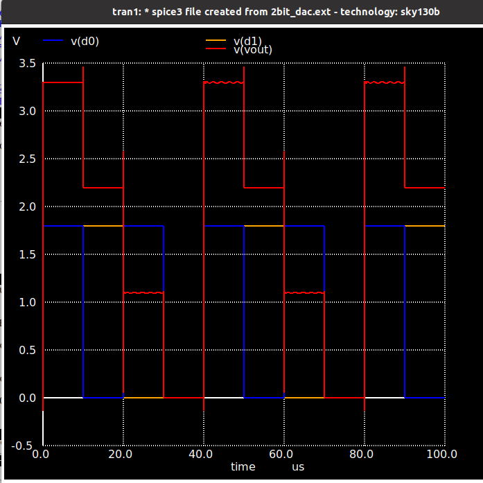</td> </tr> </table>

```bash
   ngspice 3bit_DAC_test.spice 
```
   <table> <tr> <td  align="center">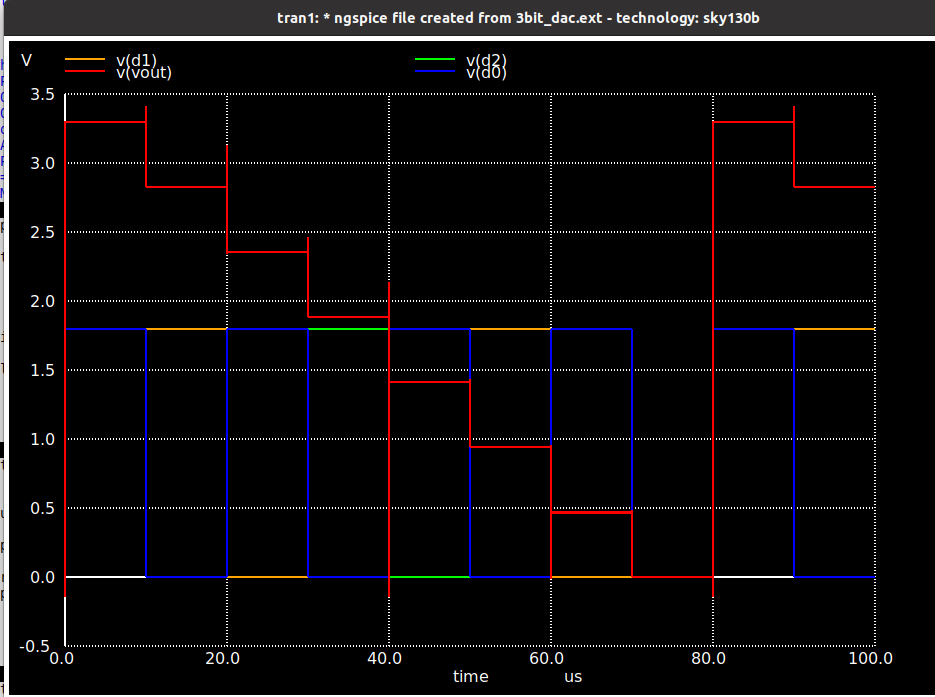</td> </tr> </table>

```bash
   ngspice 4bit_DAC_test.spice 
```
   <table> <tr> <td  align="center">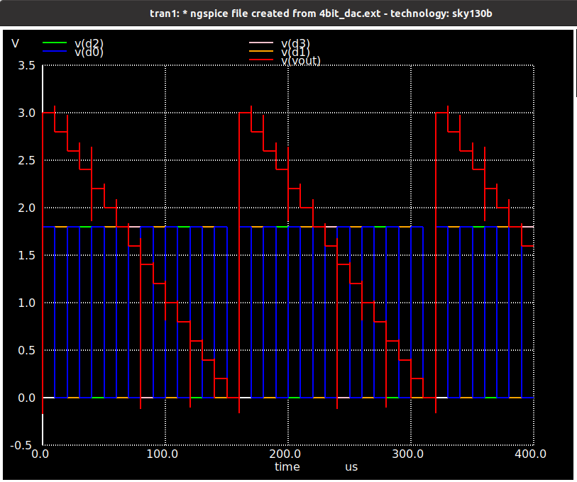</td> </tr> </table>

```bash
   ngspice 5bit_DAC_test.spice 
```
   <table> <tr> <td  align="center">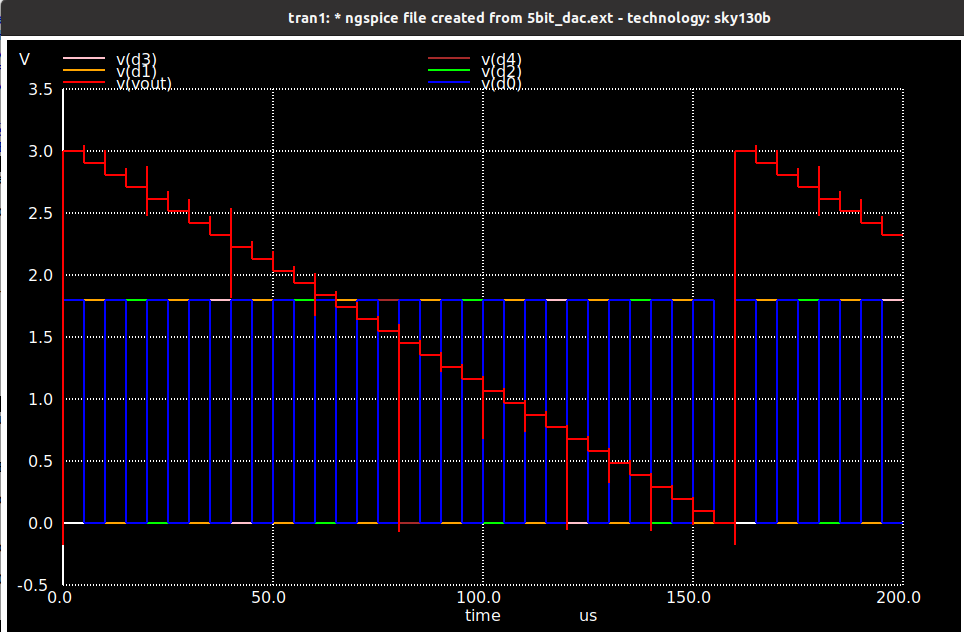</td> </tr> </table>

```bash
   ngspice 6bit_DAC_test.spice 
```
   <table> <tr> <td  align="center">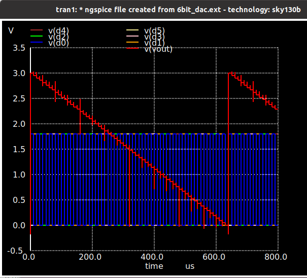</td> </tr> </table>

```bash
   ngspice 7bit_DAC_test.spice 
```
   <table> <tr> <td  align="center">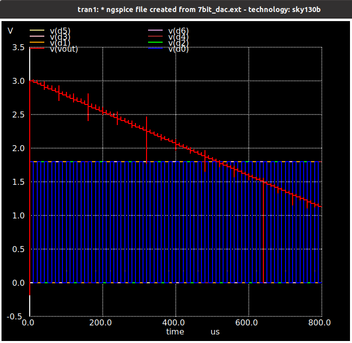</td> </tr> </table>

```bash
   ngspice 8bit_DAC_test.spice 
```
   <table> <tr> <td  align="center">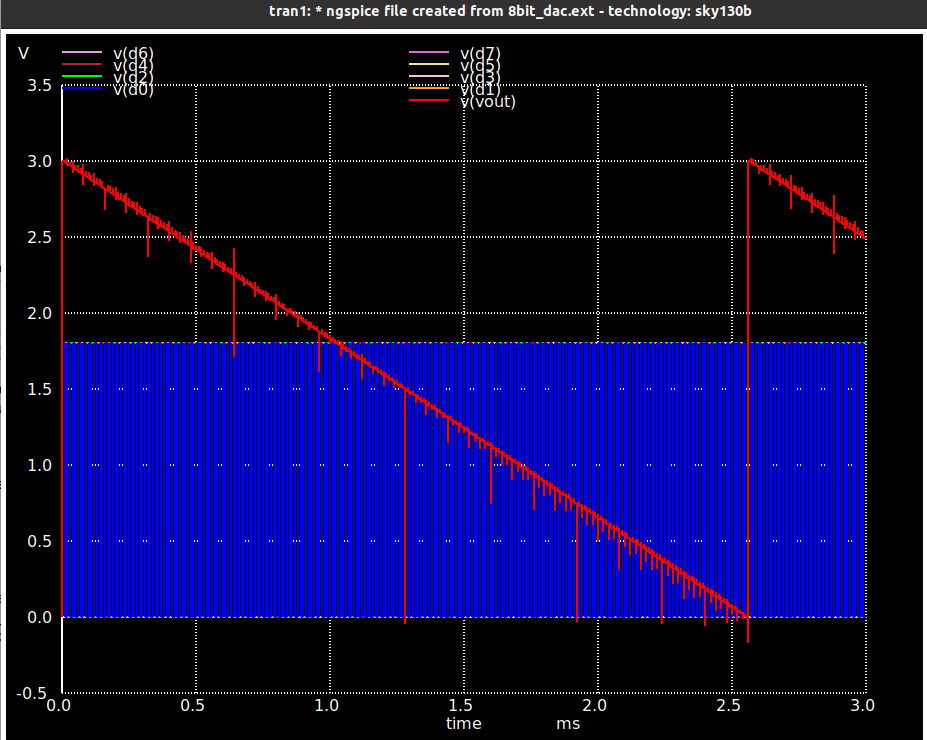</td> </tr> </table>

# Reference
Basic idea and register and switch picked from 
* **avsddac_3v3_sky130_v2 Aim** - https://github.com/vsdip/avsddac_3v3_sky130_v2
